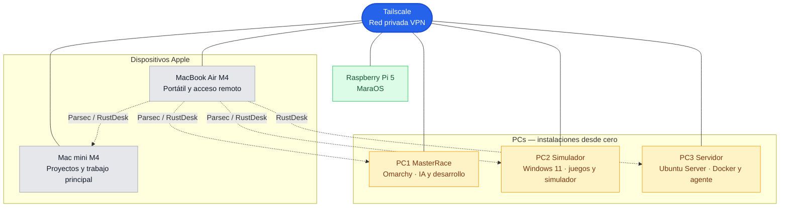

# Topología de red

## Lectura del esquema

- Las líneas continuas representan la conectividad privada común mediante Tailscale.
- Las líneas discontinuas muestran el acceso gráfico remoto habitual desde el MacBook Air.
- El acceso remoto de la Raspberry Pi está pendiente de decidir.

Ver también: [[01 - Dispositivos Apple]], [[02 - PCs]], [[03 - Raspberry Pi 5 - MaraOS]] y [[04 - Red, acceso remoto y pendientes]].
