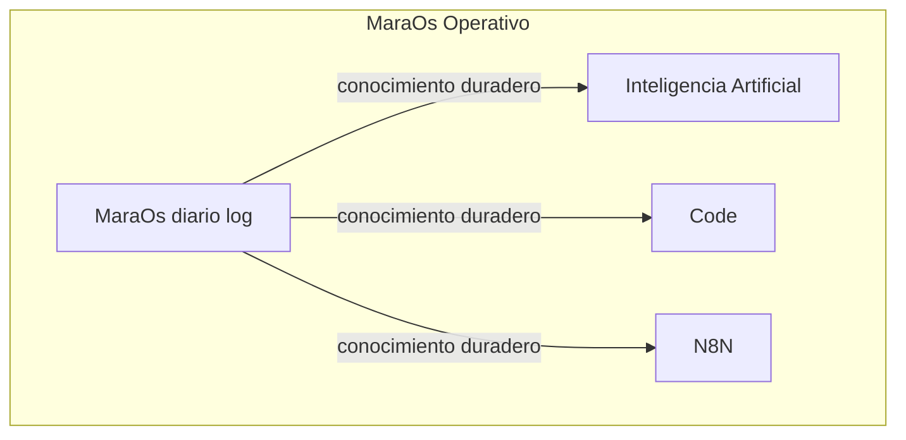
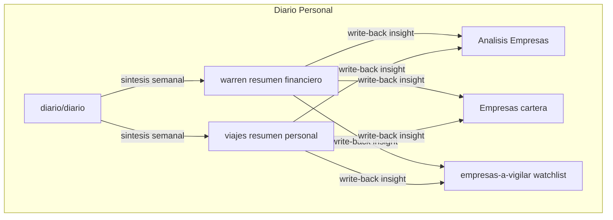
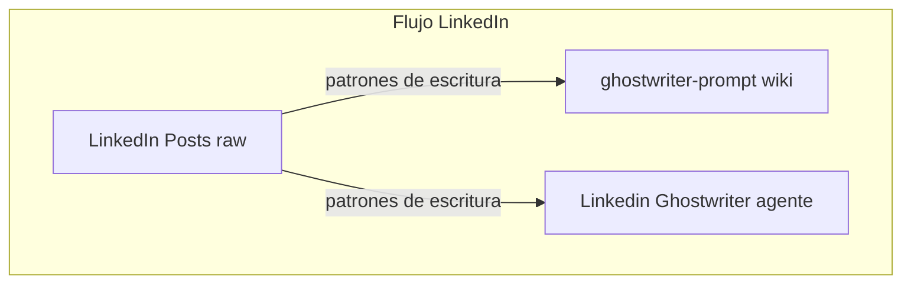
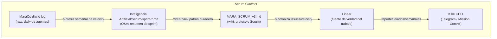

# Pipeline de conocimiento — Karpathy raw → wiki → Q&A → write-back

Este vault sigue un flujo de cuatro etapas para que el conocimiento capturado acabe siendo útil, no solo almacenado.

---

## Las 4 etapas

### 1. Raw — captura sin filtro
**Qué es:** notas de entrada sin elaborar. Observaciones, ideas sueltas, logs operativos, capturas del momento.
**Tipos en este vault:** `type: diario`, `type: social` (borradores de posts), notas con `pipeline: raw`.
**Dónde vive:** `MaraOs/diario/diario/`, borradores en `redes sociales/`.
**Regla:** no editar ni pulir. Solo capturar. La revisión viene después.

### 2. Wiki — conocimiento elaborado
**Qué es:** notas permanentes con contexto, estructura y enlaces. El conocimiento procesado que tiene valor duradero.
**Tipos en este vault:** `type: resource`, `type: nota`, `type: ia`, `type: agent`, `type: moc`, `type: wiki`.
**Dónde vive:** `Inteligencia Artificial/`, `Code/`, `N8N/`, `Work/`, `MaraOs/` (agentes), `tags/` (MOCs).
**Regla:** cada nota wiki debe tener título claro, tags precisos y al menos un enlace a otro concepto relacionado. Si viene de raw, el campo `promotes_to` en la nota origen debe apuntar aquí.

### 3. Q&A — síntesis activa
**Qué es:** preguntas reales respondidas usando la wiki como fuente. La respuesta no es buscar en Google — es consultar primero las propias notas.
**Tipos en este vault:** `type: analisis` (resúmenes semanales de Warren), síntesis periódicas de MaraOs.
**Dónde vive:** `MaraOs/diario/warren/`, `MaraOs/diario/viajes/`.
**Regla:** si la wiki no tiene la respuesta, eso es una señal de que falta una nota. Créala.

### 4. Write-back — refactoring hacia la wiki
**Qué es:** cuando una respuesta Q&A o un insight del diario tiene valor permanente, se escribe de vuelta como nota wiki o se actualiza una existente.
**Cómo:** cambia `pipeline: raw` → `pipeline: wiki` en el frontmatter y mueve/refactora la nota a su carpeta definitiva. Actualiza el campo `promotes_to` en la nota origen.
**Señal de que toca hacer write-back:** una nota `type: analisis` que responde la misma pregunta varias semanas seguidas → esa respuesta merece ser nota wiki permanente.

---

## Mapa de flujo en este vault

```
diario/diario/*.md          (raw: log diario)
        ↓ síntesis semanal
diario/warren/*.md          (Q&A: resumen financiero)
diario/viajes/*.md          (Q&A: resumen personal)
        ↓ write-back cuando hay insight duradero
MaraOs/Warren/Analisis Empresas.md   (wiki: plantilla análisis)
MaraOs/Warren/Empresas.md            (wiki: cartera)
Work/Renta Variable/empresas-a-vigilar.md  (wiki: watchlist)

redes sociales/linkedin/Linkedin Posts/*.md   (raw: posts publicados)
        ↓ promueve patrones de escritura
redes sociales/linkedin/linkedin-ghostwriter-prompt.md  (wiki: prompt curado)
Inteligencia Artificial/Custom GPTS/Linkedin Ghostwriter.md  (wiki: agente)

MaraOs/diario/diario/*.md   (raw: log operativo)
        ↓ si emerge conocimiento duradero
Inteligencia Artificial/ o Code/ o N8N/  (wiki: nota permanente)

MaraOs/diario/diario/*.md   (raw: daily log de agentes)
        ↓ síntesis semanal de velocity
Inteligencia Artificial/Scrum/sprint-*.md   (Q&A: resumen de sprint)
        ↓ write-back si hay patrón de proceso duradero
Inteligencia Artificial/Scrum/MARA_SCRUM_v3.md  (wiki: protocolo Scrum de Mara)
```

---

## MaraOS Operativo



## Diario Personal



## Flujo Linkedin



## Flujo Scrum — Clawbot/OpenClaw



---

## Convención de campos en frontmatter

| Campo | Raw | Wiki | Q&A |
|-------|-----|------|-----|
| `pipeline` | `raw` | `wiki` | `qa` |
| `promotes_to` | `[[nota destino]]` | — | `[[nota destino]]` |
| `status` | `active` | `active` | `active` |

---

## Notas relacionadas

- [[Vault]] — portada principal
- [[moc-agentesia]] — cluster de wiki sobre IA
- [[moc-proyectos]] — cluster de wiki sobre proyectos y finanzas
- [[moc-maraos]] — sistema de agentes (raw + wiki mezclados)
- [[Inteligencia Artificial/Scrum/MARA_SCRUM_v3]] — protocolo Scrum de Mara con Linear MCP
